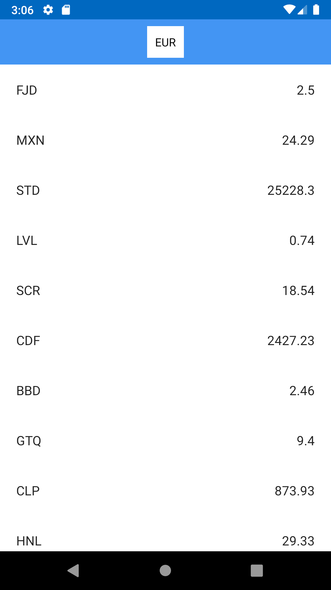
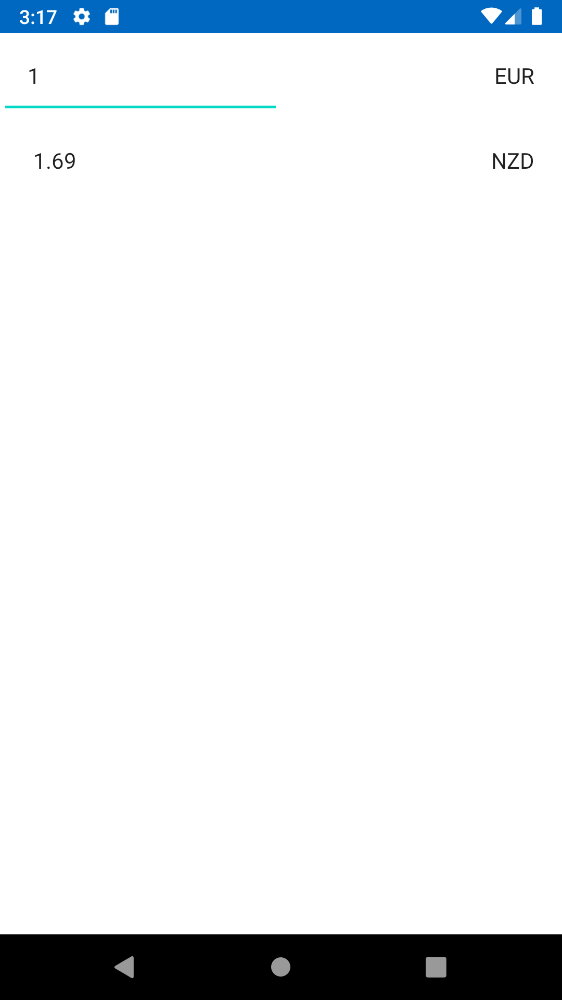

Currency Converter
=========================================
Android Application to Show list of Currencies Rate based on EUR

Getting Started
---------------
To build this project, use the `gradlew build` command or use "Import Project" in Android Studio v4.0+.

There are two Gradle tasks for testing the project But not implemented yet :
* `connectedAndroidTest` - for running Espresso on a connected device
* `test` - for running unit tests

### Fixer API key

The App uses the [Fixer API](https://fixer.io/documentation) to Currencies rates based on Eur . To use the API, you will need to obtain a developer Access key. See the
[Fixer API Documentation](https://fixer.io/quickstart) for instructions.

Once you have the key, add this line to the `gradle.properties` file, either in your user home
directory (usually `~/.gradle/gradle.properties` on Linux and Mac) or in the project's root folder:

```
Fixer_access_key=<your flickr access key> 

```

The app isn't usable without an API key

Screenshots
-----------




Project Architecture
--------------------
the project's folders are organized in feature grouped for business feature and MVVM for the project code.
for use cases you will find them in domain folder
for the Di ( i have used mixed way between Koin and manual Di using Service Locator)
for shared utils you will find them in shared folder which will be used across the application 


Android Studio IDE setup
------------------------
The App uses [ktlint](https://ktlint.github.io/) to enforce Kotlin coding styles.

- Close Android Studio if it's open

- Download ktlint using these [installation instructions](https://github.com/pinterest/ktlint/blob/master/README.md#installation)

- Apply ktlint settings to Android Studio using these [instructions](ktlint applyToIDEAProjecthttps://github.com/pinterest/ktlint/blob/master/README.md#-with-intellij-idea)

- Start Android Studio
